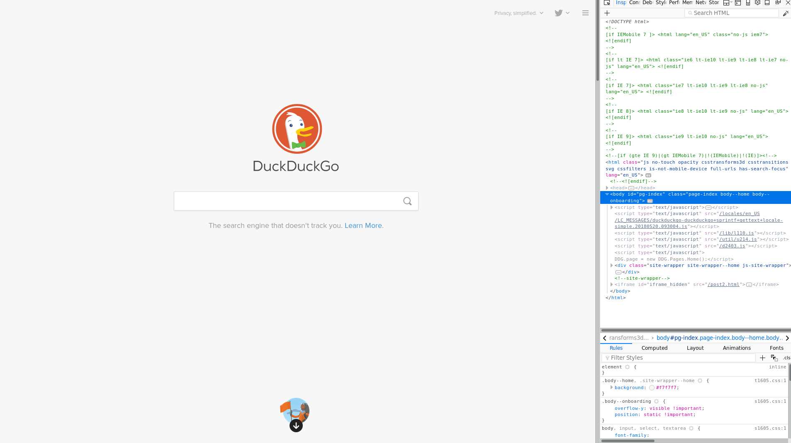
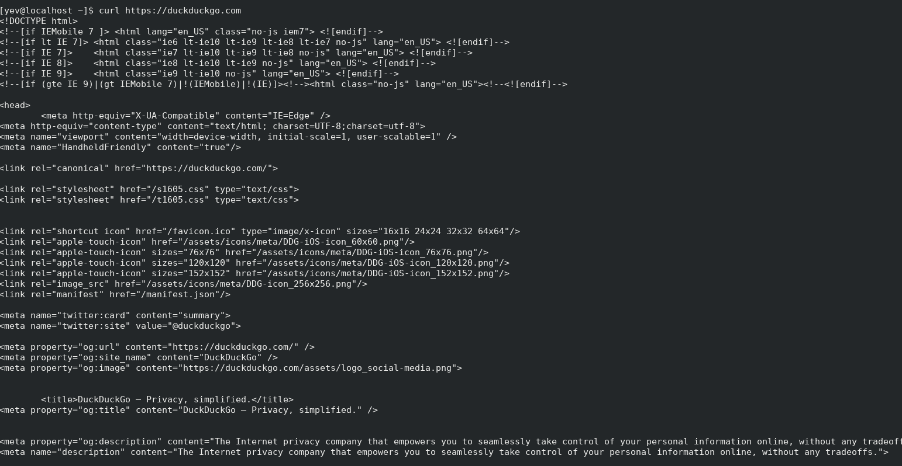
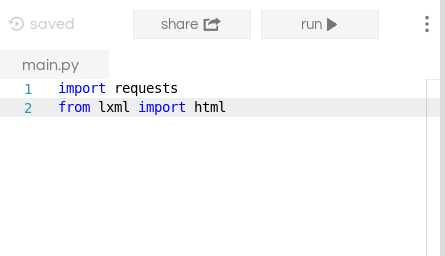

| name | description | author |
| :----: | :-----------: | :------: |
| Scraping a scraping workshop | A few cool hacks with web scraping | ([@yevbar](https://github.com/yevbar)) |

# WEB SCRAPING 101

Today we're going to do a few cool hacks with python and web scraping! I'm using python because it's a nice language though there's nothing stopping you from trying this out in Javascript or Assembly (though I wouldn't really recommend the latter).

Before we get to the scraping we need to understand a few things about how the internet works.

In a nutshell, the internet is just a bunch of computers giving each other high fives. When a computer goes to "https://duckduckgo.com", what's really going on is that the computer is putting its hand up to the internet and asking for a "https://duckduckgo.com". When it gets a high five back, it's getting a high five from a server that gives it some HTML code. To see what that looks like, you can go to "https://duckduckgo.com" and then inspect element. You should see something like this



This is what web pages really look like! To get this as plain text, you can also go to a terminal and run `curl` like so



Though we won't need to know much networking to accomplish the tasks we're aiming for (though some knowledge on browser sessions and POST requests will come in handy for more elaborate web scraping scripts)

Starting simple, we're going to put together a script that obtains the first paragraph of a Wikipedia article as a TL;DR for some topic. To start out, we're going to install two libraries

[](https://repl.it/@yevbar/Web-Scraping-Imports)

```python
import requests
from lxml import html
```

The `requests` library (api?) is what we'll use to handle the making requests and the `html` library is how we'll treat the html as a data structure rather than some plain text.

Before we go about making requests, we should check to see what we're scraping for specifically. To do that, let's go to some Wikipedia article, here I'm going to the page on memes.

<<insert screenshot here>>

And what we want to obtain is this first paragraph, which sort of act as a TL;DR for the entire topic.
