| name | description | author |
| :----: | :-----------: | :------: |
| Scraping a scraping workshop | A few cool hacks with web scraping | ([@yevbar](https://github.com/yevbar)) |

# WEB SCRAPING 101

Today we're going to do a few cool hacks with python and web scraping! I'm using python because it's a nice language though there's nothing stopping you from trying this out in Javascript or Assembly (though I wouldn't really recommend the latter).

Before we get to the scraping we need to understand a few things about how the internet works.

In a nutshell, the internet is just a bunch of computers giving each other high fives. When a computer goes to "https://duckduckgo.com", what's really going on is that the computer is putting its hand up to the internet and asking for a "https://duckduckgo.com". When it gets a high five back, it's getting a high five from a server that gives it some HTML code. To see what that looks like, you can go to "https://duckduckgo.com" and then inspect element. You should see something like this


This is what web pages really look like! To get this as plain text, you can also go to a terminal and run `curl` like so


Though we won't need to know much networking to accomplish the tasks we're aiming for (though some knowledge on browser sessions and POST requests will come in handy for more elaborate web scraping scripts)

Starting simple, we're going to put together a script that obtains the first paragraph of a Wikipedia article as a TL;DR for some topic. To start out, we're going to install two libraries

```python
import requests
from lxml import html
```

The `requests` library is what we'll use to handle the making requests and the `html` library is how we'll treat the html as a data structure rather than plain text.

Before we go about making requests, we should check to see what we're scraping for specifically. To do that, let's go to some Wikipedia article, here I'm going to the page on memes.

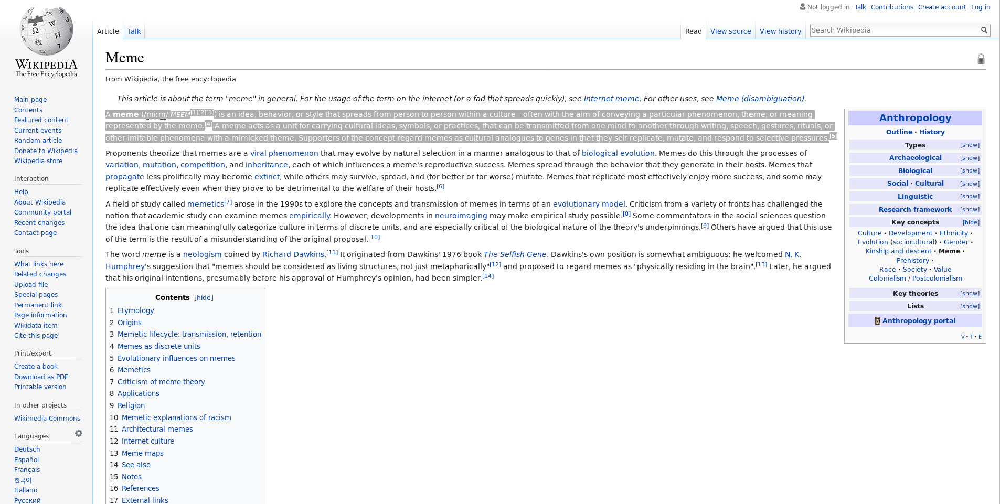

What we want to obtain is this first paragraph, which sort of acts as a TL;DR for the entire topic. Opening up inspect element and hovering over a particular p tag highlights the section around that first paragraph which means we've found the specfic element we're looking for!

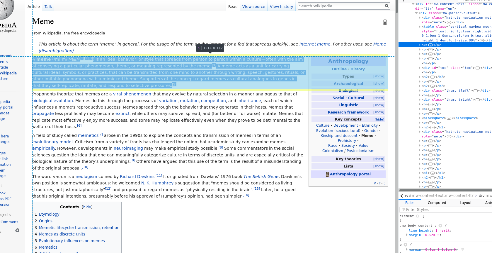

By pressing the arrows to the left of the tags, we can see this tree like structure of the whole paragraph

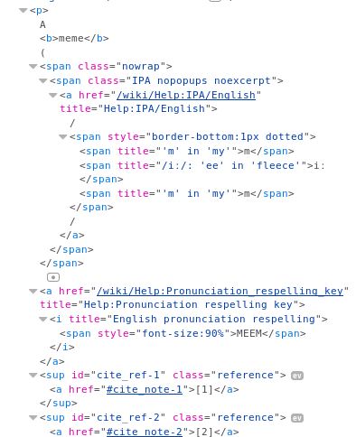

We don't need to stress over the specific tags and such in the paragraph, those are mostly for the citations. To get the text, we simply get the `text` value of the element. But to get the element in the first place, we're going to use `xpath` to navigate the XML (which in this case is the HTML) of the file, and is why we imported the `html` library earlier.

Now to get working!

```python
import requests
from lxml import html

my_session = requests.session()
```

The first thing we're going to do is initialize a `session` object. While you could simply call the function from that class, it helps with readability and a session is needed for more elaborate web scraping.

```python
import requests
from lxml import html

my_session = requests.session()
page = my_session.get("https://en.wikipedia.org/wiki/Meme")
```

We can't do much with the `page` variable since it's a `Response` object but that's why we have the `html` library!

```python
import requests
from lxml import html

my_session = requests.session()
page = my_session.get("https://en.wikipedia.org/wiki/Meme")

tree = html.fromstring(page.text)
```
To get the `xpath` of the paragraph we're looking for, we go the inspect element pane, right click on the specific element, select "copy", and then select "xpath"

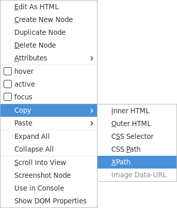

I got the following statement in my clipboard

```
/html/body/div[3]/div[3]/div[4]/div/p[1]
```

To use the `xpath` in our program is nice and simple!

```python
import requests
from lxml import html

my_session = requests.session()
page = my_session.get("https://en.wikipedia.org/wiki/Meme")

tree = html.fromstring(page.text)
first_paragraph = tree.xpath("/html/body/div[3]/div[3]/div[4]/div/p[1]")[0].text_content()
```

The `[0]` after the function call is to get the first (and only) element because `xpath` returns a list of elements that satisfy the given condition and `text_content()` is how you get the `text` of the element.

All that's left to do is print the first paragraph and...

[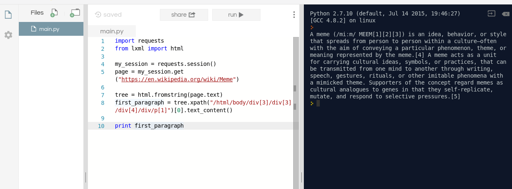](https://repl.it/@yevbar/Web-Scraping-Complete)

That was a nice project with web scraping, now we're going to use web scraping as an alternative to using an API to grab a handful of Tweets from Twitter

For this, I'll be using my Twitter profile (for shameless advertising)

[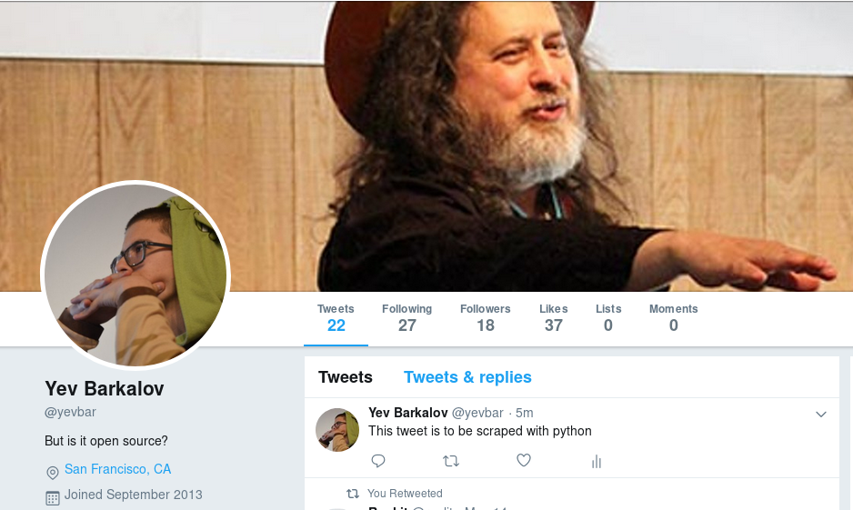](https://twitter.com/yevbar)

We can go ahead and prepare the libraries we need

```python
import requests
from lxml import html
```

As before, we need to look around in the html to find whatever we're scraping for and a right click on one of the tweets will reveal that each tweet is in an `<li>` tag

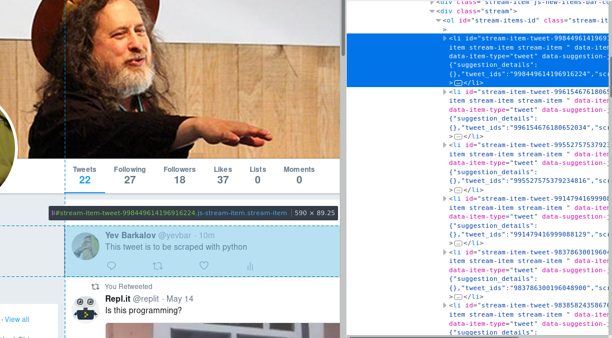

So to get every tweet we can off of this page (I'll explain why I say _can_ shortly), we need to first find the `xpath` for this tweet. Some more digging will show that the text of the tweet is in a `<p>` tag

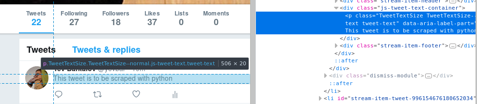

Copying the 'xpath' gives me the following in my clipboard

```
/html/body/div[2]/div[2]/div/div[4]/div/div/div[2]/div/div[2]/div[4]/div/div[2]/ol[1]/li[1]/div[1]/div[2]/div[2]/p
```

Before we try to expand to multiple tweets, let's make sure that the text from this tweet works and, to do that, we're going to use the code from the Wikipedia scraper but replace the url and xpath to get

```python
import requests
from lxml import html

my_session = requests.session()
page = my_session.get("https://twitter.com/yevbar")

tree = html.fromstring(page.text)
tweet = tree.xpath("/html/body/div[2]/div[2]/div/div[4]/div/div/div[2]/div/div[2]/div[4]/div/div[2]/ol[1]/li[1]/div[1]/div[2]/div[2]/p")[0].text_content()

print tweet
```

Well, I'm getting an index out of range error which can only be explained by the xpath not returning anything but... how can this be??

And this goes into why I said "can" earlier, which is that, when Twitter (or many other sites) give you a webpage, they don't give you a complete webpage. Whatever's left from the page is either retrieved from another request (e.g. a feed) or from a CDN that requires the browser to retrieve content itself. However, in this case, this would only prevent us from obtaining all the tweets on a profile because we can't scroll down.

The likely situation at hand is that the browser I'm using renders and fills in some html to result in the above xpath which is different from what the python code obtains. But xpath is very nice because we don't need to describe a certain path but, instead, we can describe a certain collection of nodes or elements.

So, to approach this, we need to be able to identify a tweet from the html and then dig in to get the text from it. Well, that's not very difficult if we realize that tweets are the only `<li>` elements in the page so, to pluck that out we do the following

```
//li
```

The "//" indicate that we are looking for this particular element anywhere in the directory (which happens to be "root" or `<html>`) but we also need to add in the `p` tag to get the text for the tweet

```
//li//p
```

Putting this into the code from before

```python
import requests
from lxml import html

my_session = requests.session()
page = my_session.get("https://twitter.com/yevbar")

tree = html.fromstring(page.text)
tweet = tree.xpath("//li//p")[0].text_content()

print tweet
```

Now, when I run, I get my most recent tweet!

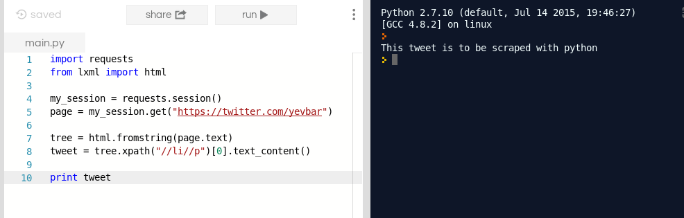

But how can we get more than the first tweet? Well, unless you're unfamiliar to python lists, the answer is simple

```python
import requests
from lxml import html

my_session = requests.session()
page = my_session.get("https://twitter.com/yevbar")

tree = html.fromstring(page.text)
tweets = tree.xpath("//li//p")

print "~"
for tweet in tweets:
  print tweet.text_content() + "\n~"
```

Putting it into action

[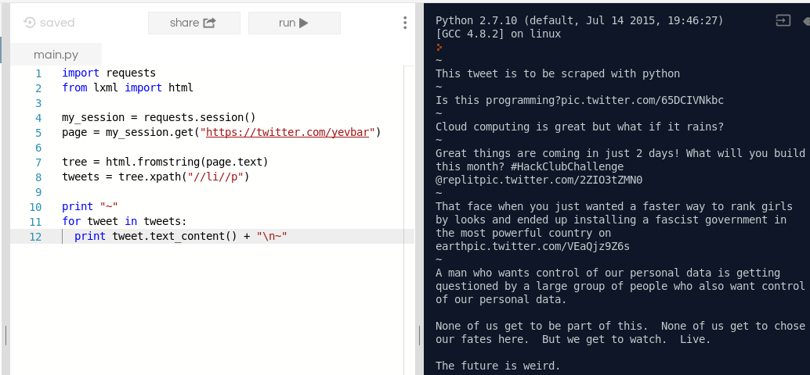](https://repl.it/@yevbar/Twitter-Scraper)

So, voila, you have successfully hacked around using an API with a web scraper!

In this case, there actually was a Twitter API that we could have used instead but what's really cool is that you can create an API with web scraping!

[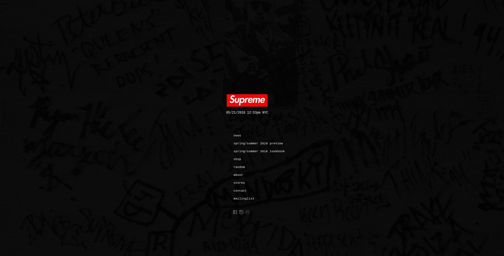](http://www.supremenewyork.com/)

For this, our target will be Supreme clothing
